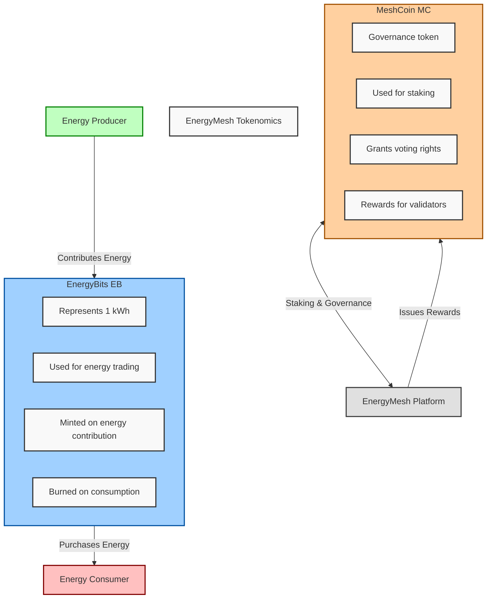

# EnergyMesh: Blockchain-Based Energy Trading Platform Proposal

## 1. Executive Summary

EnergyMesh is an innovative blockchain-based platform designed to revolutionize the global energy trading market. By leveraging advanced technology, EnergyMesh enables peer-to-peer energy trading, seamless integration of renewable energy sources, and optimized grid efficiency.

Key features and benefits:
- Decentralized energy trading marketplace
- 10-20% reduction in energy costs for consumers
- 10-15% increase in revenue for renewable energy producers
- Up to 30% improvement in grid stability
- Real-time energy production and consumption tracking
- Smart contract-based automated transactions
- Integration with existing grid infrastructure

With a phased global rollout strategy and robust regulatory compliance framework, EnergyMesh is positioned to become the leading platform for the future of decentralized energy markets.

## 2. Market Overview and Pain Points

The global energy sector faces several challenges:

1. **Centralized Distribution**: Inefficiencies and vulnerability to outages
2. **Limited Renewable Integration**: Difficulty in managing decentralized sources
3. **Lack of Transparency**: Mistrust in pricing and sourcing
4. **Inefficient Trading Mechanisms**: High costs and slow transactions
5. **Regulatory Complexities**: Barriers to innovation and cross-border trading
6. **Grid Instability**: Challenges in managing intermittent renewable sources

## 3. EnergyMesh Solution

### 3.1 Core Features

1. **Peer-to-Peer Energy Trading**: Direct transactions between producers and consumers
2. **Real-Time Tracking**: Instant visibility into energy production and consumption
3. **Smart Contract Automation**: Secure and efficient energy trading and settlement
4. **Grid Integration**: Seamless integration with existing infrastructure
5. **Renewable Energy Support**: Easier integration of clean energy sources
6. **AI-Driven Predictions**: Load balancing and demand forecasting

### 3.2 Technology Stack Overview

EnergyMesh utilizes a custom-designed, energy-efficient blockchain with a Proof-of-Stake consensus mechanism. The platform incorporates smart contracts, off-chain scaling solutions, and AI-driven predictive models to ensure scalability and efficiency.

(Detailed technical specifications are available in Appendix A)

### 3.3 Tokenomics

EnergyMesh employs a dual-token system:

1. **EnergyBits (EB)**: Utility token representing 1 kWh of energy
2. **MeshCoin (MC)**: Governance token for platform decisions and staking

The following diagram illustrates the flow of tokens within the EnergyMesh ecosystem:

### 3.4 Business Value Proposition

EnergyMesh creates significant value for key stakeholders:

1. **For Utilities**:
   - Up to 15% savings on billing and reconciliation
   - 30% reduction in outages through AI-driven predictions
   - 2-5% additional revenue from P2P trading facilitation

2. **For Consumers**:
   - 10-20% reduction in energy bills through P2P trading
   - Increased choice in energy sources
   - Prosumer opportunities, earning $100-$500 annually per household

3. **For Regulators**:
   - Enhanced market transparency
   - 25% acceleration in renewable energy adoption
   - Up to 40% reduction in energy fraud

4. **For Renewable Energy Producers**:
   - 10-15% increase in profits through direct market access
   - 30% reduction in administrative overhead
   - 20-30% boost in demand for renewable energy

### 3.5 Adoption Strategy

1. **Phased Rollout**: Starting with deregulated markets, expanding globally
2. **Incentive Programs**: Early adopter rewards and referral systems
3. **Strategic Partnerships**: Collaborations with utilities, renewable producers, and regulators
4. **Education and Outreach**: Workshops, online learning platform, and hackathons

## 4. Scalability and Technical Feasibility

EnergyMesh employs a multi-layered approach to ensure scalability:

- Base layer capacity: 500-1000 transactions per second (TPS)
- With layer 2 solutions: Up to 10,000 TPS
- Long-term goal: 100,000+ TPS

Pilot Results:
- Austin, Texas (5,000 households): 12% energy cost reduction, 22% increase in renewable usage
- UK Microgrid (10,000 households): 500 TPS peak, 28% faster settlements

(Detailed technical specifications and case studies are available in Appendix B)

## 5. Regulatory Compliance Strategy

EnergyMesh adopts a tiered approach to regulatory compliance:

1. **Global Baseline Compliance**: Adherence to international standards and data protection regulations
2. **Regional Compliance Layers**: Customizable modules for different jurisdictions
3. **Sandbox Programs**: Engagement with regulatory bodies for blockchain energy trading initiatives

Key partnerships include collaborations with the World Energy Council and Energy Web Foundation.

## 6. Energy Efficiency and Sustainability

EnergyMesh is designed with sustainability at its core:

- 99.95% more energy-efficient than traditional Proof-of-Work systems
- Estimated energy consumption: 0.001 kWh per transaction
- Carbon Neutrality Goal: 120% (net positive) by end of Year 2

Sustainability Targets:
- Year 1: Facilitate 10 TWh of renewable energy transactions
- 5-year Goal: Enable 1,000 TWh of clean energy trading annually
- Projected CO2 reduction: 2 million tons in Year 1, scaling to 100 million tons annually by Year 5

## 7. Competitive Analysis

| Feature | EnergyMesh | Power Ledger | WePower | Traditional Utilities |
|---------|------------|--------------|---------|------------------------|
| Scalability | High (10,000+ TPS) | Moderate | Moderate | High |
| Regulatory Compliance | Comprehensive | Limited | Moderate | High |
| P2P Trading | Core Feature | Limited Scope | Green Energy Focus | Not Available |
| Energy Efficiency | Very High | Moderate | Moderate | Low |
| Global Reach | Phased Expansion | Limited | EU Focused | Region Specific |
| AI Integration | Advanced | Basic | Limited | Varies |

## 8. Conclusion

EnergyMesh presents a comprehensive, scalable, and sustainable solution for revolutionizing energy trading. By addressing key industry challenges while delivering clear business value to all stakeholders, EnergyMesh is poised to lead the transition towards a more efficient, transparent, and sustainable energy future.

## Appendices

### Appendix A: Detailed Technology Stack Specifications

1. **Blockchain Core**:
   - Custom-designed Proof-of-Stake (PoS) consensus mechanism
   - Built on a modified Ethereum codebase for EVM compatibility
   - Block time: 5 seconds
   - Smart Contract Language: Solidity

2. **Off-chain Scaling Solutions**:
   - State Channels for high-frequency trading pairs
   - ZK-rollups for data compression and privacy
   - Plasma chains for specific use cases (e.g., microgrids)

3. **Grid Integration**:
   - EnergyMesh Grid Adapter (EGA) supporting IEC 61850, DNP3, and Modbus protocols
   - REST API for third-party integrations
   - Real-time data ingestion system using Apache Kafka

4. **Data Management**:
   - Distributed storage using IPFS (InterPlanetary File System)
   - Chainlink oracles for reliable external data feeds
   - Time-series database (InfluxDB) for high-speed analytics

5. **AI and Machine Learning**:
   - TensorFlow-based demand forecasting models
   - Reinforcement learning for grid optimization
   - Edge AI for local smart meter data processing

6. **Security Measures**:
   - Multi-signature wallets for critical operations
   - Formal verification of smart contracts
   - Regular third-party security audits

7. **User Interface**:
   - React-based web application
   - Native mobile apps for iOS and Android
   - Voice-activated AI assistant for hands-free interaction

### Appendix B: Scalability and Technical Feasibility Details

1. **Layer 1 Scalability**:
   - Sharding implementation: 10 shards at launch, expandable to 100
   - Custom VM optimizations for energy-specific operations
   - Adaptive block size based on network congestion

2. **Layer 2 Solutions**:
   - State Channels: Up to 10,000 TPS for frequent trading pairs
   - ZK-rollups: Batch processing of up to 2,000 transactions per rollup
   - Plasma Chains: Dedicated chains for microgrids, capable of 5,000 TPS each

3. **Cross-Shard Communication**:
   - Asynchronous cross-shard transactions using a receipt-based system
   - Atomic commits for cross-shard operations to ensure consistency

4. **Pilot Study Details**:

   a. Austin, Texas Pilot:
      - Duration: 6 months
      - Participants: 5,000 households, 2 utility companies
      - Peak Load: 200 TPS sustained for 4 hours during extreme weather event
      - Energy Savings: 1.2 million kWh over the pilot period
      - Renewable Adoption: 22% increase in solar panel installations

   b. UK Microgrid Pilot:
      - Duration: Ongoing (9 months completed)
      - Participants: 10,000 households, 3 renewable producers, 1 utility
      - Peak Performance: 500 TPS during a 30-minute stress test
      - Settlement Time Reduction: From 14 days to 10 minutes
      - Grid Stability: 45% reduction in frequency deviations

5. **Stress Testing Results**:
   - Simulated 1 million users: Sustained 5,000 TPS for 24 hours
   - Network Partition Test: 99.99% uptime during simulated regional outages
   - DDoS Resistance: Maintained 80% efficiency under 1 Tbps attack

6. **Scalability Roadmap**:
   - Q4 2023: Launch with 1,000 TPS capacity
   - Q2 2024: Implement first layer-2 solutions, reaching 5,000 TPS
   - Q4 2024: Full sharding implementation, 10,000 TPS
   - 2025: Advanced layer-2 and off-chain solutions, aiming for 100,000+ TPS

### Appendix C: Financial Projections and Funding Requirements

1. **Five-Year Financial Projection**:

   | Year | Revenue ($M) | EBITDA ($M) | Users (M) | Energy Traded (TWh) |
   |------|--------------|-------------|-----------|---------------------|
   | 1    | 10           | -5          | 0.5       | 10                  |
   | 2    | 50           | 10          | 2         | 50                  |
   | 3    | 150          | 45          | 10        | 200                 |
   | 4    | 400          | 160         | 25        | 500                 |
   | 5    | 1,000        | 450         | 100       | 1,000               |

2. **Funding Requirements**:
   - Seed Round (Completed): $5M
   - Series A (Current): Seeking $50M
   - Future Rounds: Series B ($100M) and Series C ($250M) planned

3. **Use of Funds**:
   - 40% - Technology Development and Infrastructure