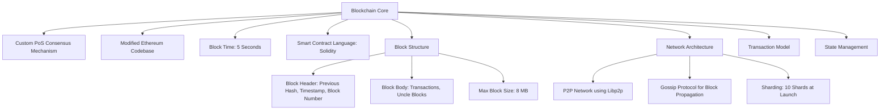
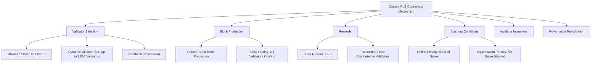
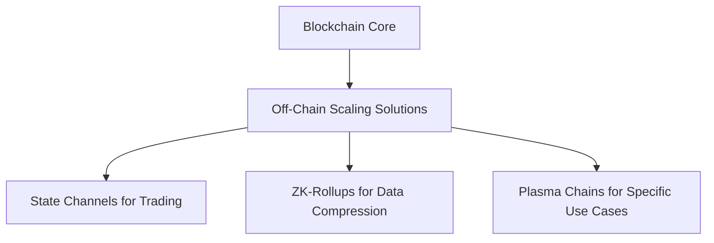
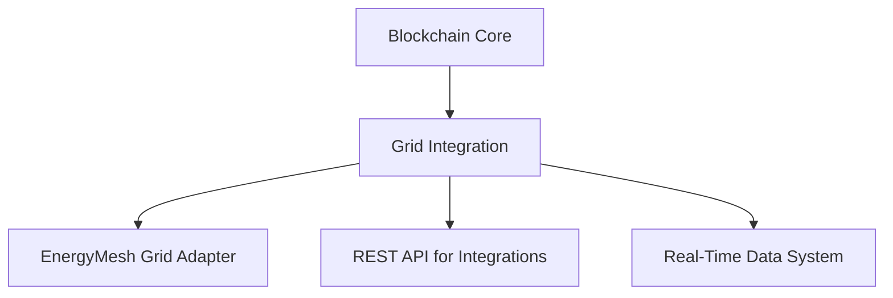
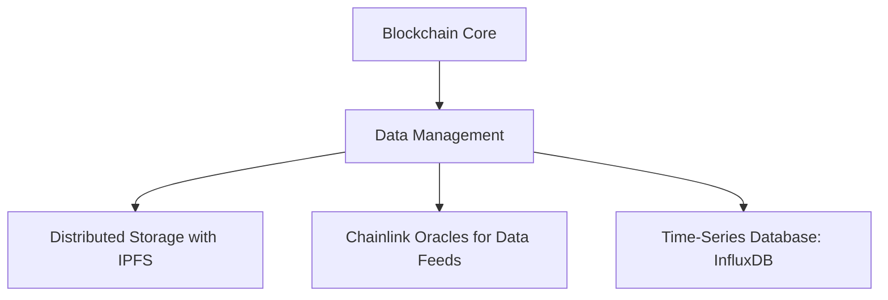
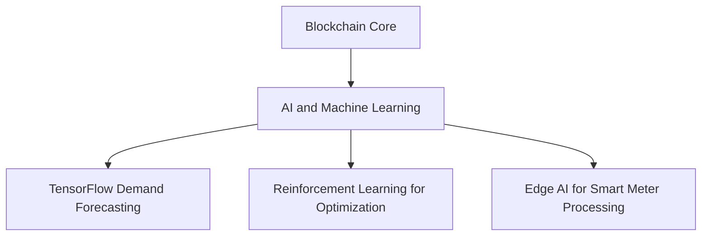
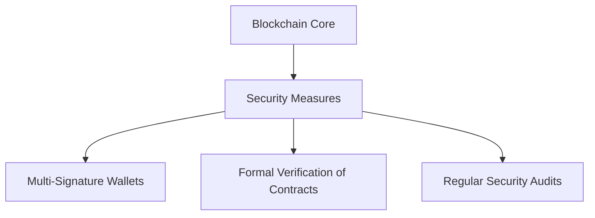
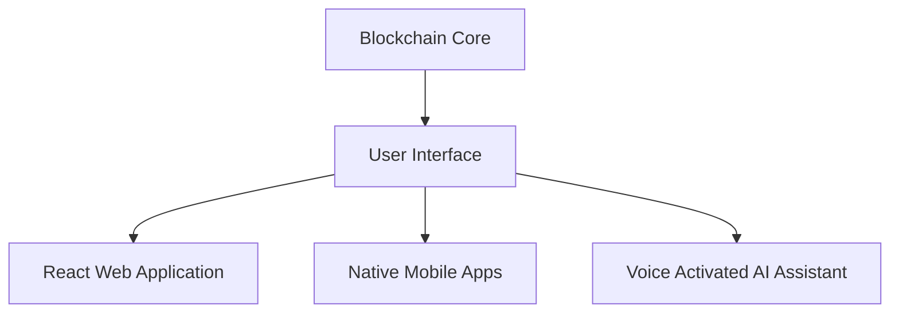
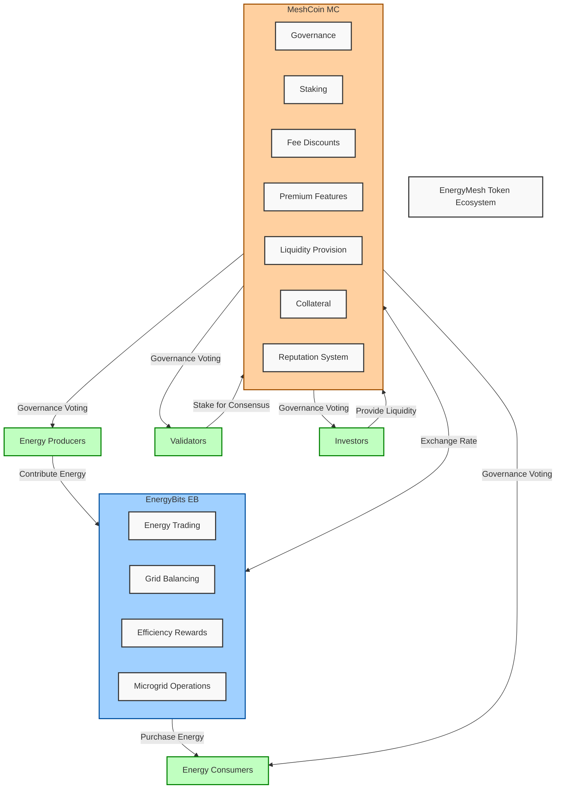

# EnergyMesh: Blockchain-Based Energy Trading Platform Proposal

## Table of Contents
1. [Executive Summary](#1-executive-summary)
2. [Market Overview and Pain Points](#2-market-overview-and-pain-points)
3. [EnergyMesh Solution](#3-energymesh-solution)
4. [Scalability and Technical Feasibility](#4-scalability-and-technical-feasibility)
5. [Regulatory Compliance Strategy](#5-regulatory-compliance-strategy)
6. [Competitive Analysis](#6-competitive-analysis)
7. [Conclusion](#7-conclusion)
8. [Appendices](#8-appendices)

## 1. Executive Summary

EnergyMesh is an innovative blockchain-based platform designed to revolutionize the global energy trading market. By leveraging advanced technology, EnergyMesh enables peer-to-peer energy trading, seamless integration of renewable energy sources, and optimized grid efficiency.

Key features and benefits:
- Decentralized energy trading marketplace
- 10-20% reduction in energy costs for consumers
- 10-15% increase in revenue for renewable energy producers
- Up to 30% improvement in grid stability
- Real-time energy production and consumption tracking
- Smart contract-based automated transactions
- Integration with existing grid infrastructure

With a phased global rollout strategy and robust regulatory compliance framework, EnergyMesh is positioned to become the leading platform for the future of decentralized energy markets.

## 2. Market Overview and Pain Points

The global energy sector is facing multiple challenges that impact its efficiency, sustainability, and reliability. Below is an overview of these key challenges, supported by relevant research:

### 2.1 Centralized Distribution: Inefficiencies and Vulnerability to Outages
Centralized energy systems often lead to inefficiencies and are vulnerable to outages due to reliance on a limited number of large power plants. The World Economic Forum emphasizes the need for new strategies to ensure a reliable energy supply amidst climate-related disasters and geopolitical tensions [1].

### 2.2 Limited Renewable Integration: Difficulty in Managing Decentralized Sources
Integrating renewable energy into existing grids remains difficult. The intermittent nature of sources like wind and solar complicates grid management and requires significant infrastructure investment. The International Energy Agency (IEA) notes that current market frameworks hinder the large-scale deployment of low-carbon technologies [3][5].

### 2.3 Lack of Transparency: Mistrust in Pricing and Sourcing
The energy sector often lacks transparency in pricing and sourcing, leading to consumer mistrust and deterring investment in cleaner technologies. Higher energy prices, particularly in emerging economies, have contributed to inflation and economic strain [2].

### 2.4 Inefficient Trading Mechanisms: High Costs and Slow Transactions
Current trading mechanisms in the energy sector are slow and costly, limiting market participation and hindering the exchange of resources. The World Bank highlights the need for market reforms to better integrate low-carbon technologies and improve efficiency [3].

### 2.5 Regulatory Complexities: Barriers to Innovation and Cross-Border Trading
Complex regulatory frameworks create barriers that inhibit innovation and cross-border trading, complicating international cooperation. Geopolitical tensions have led to reevaluations of energy policies, further complicating these challenges [2][4].

### 2.6 Grid Instability: Challenges in Managing Intermittent Renewable Sources
As more intermittent renewable sources are added to the energy mix, grid instability becomes a significant concern. Aging infrastructure struggles to handle these fluctuations. The World Economic Forum notes that robust investments in grid infrastructure and storage solutions are crucial [5].

#### Citations:
[1] [World Economic Forum](https://www.weforum.org/agenda/2022/11/eight-realities-shaping-the-global-future-of-energy/)
[2] [International Energy Agency (IEA)](https://www.iea.org/topics/global-energy-crisis)
[3] [World Bank Blog](https://blogs.worldbank.org/en/developmenttalk/the-global-energy-challenge)
[4] [IEA News](https://www.iea.org/news/the-energy-world-is-set-to-change-significantly-by-2030-based-on-today-s-policy-settings-alone)
[5] [Power Technology](https://www.power-technology.com/sponsored/game-changing-the-digitalisation-trends-solving-the-energy-sectors-biggest-challenges/)

## 3. EnergyMesh Solution

### 3.1 Core Features

1. **Peer-to-Peer (P2P) Energy Trading**
   - **Benefit**: Enables direct transactions between producers and consumers, reducing reliance on intermediaries. P2P trading through blockchain increases market efficiency and reduces costs [5].

2. **Real-Time Tracking**
   - **Benefit**: Provides instant visibility into energy production and consumption. Blockchain allows for real-time energy flow tracking, optimizing distribution and balancing supply-demand [2].

3. **Smart Contract Automation**
   - **Benefit**: Automates transactions based on predefined conditions, improving efficiency. Smart contracts minimize manual intervention, enabling faster trades [2][4].

4. **Grid Integration**
   - **Benefit**: Seamlessly integrates distributed energy resources (DERs) like solar and wind into the grid. Blockchain supports reliable integration of DERs, enhancing grid resilience [2].

5. **Renewable Energy Support**
   - **Benefit**: Simplifies the incorporation of renewable sources into the energy system. Blockchain improves renewable energy certificate (REC) trading and boosts investment in clean energy [2].

6. **AI-Driven Predictions**
   - **Benefit**: Enhances load balancing and demand forecasting. Combining AI with blockchain can reduce outages by more accurately predicting demand [1].

#### Citations:
[1] [GitHub](https://github.com/desenk/energy-smart-contract)
[2] [EpiSensor](https://episensor.com/knowledge-base/the-impact-of-blockchain-technology-on-energy-trading-and-management/)
[3] [Wiley](https://onlinelibrary.wiley.com/doi/full/10.1002/spy2.341)
[4] [MDPI](https://www.mdpi.com/2076-3417/14/1/253)
[5] [Authorea](https://www.authorea.com/users/724012/articles/708238-a-blockchain-based-smart-contract-model-for-secured-energy-trading-management-in-smart-microgrids)

### 3.2 Technology Stack Overview

EnergyMesh utilizes a custom-designed, energy-efficient blockchain with a Proof-of-Stake consensus mechanism. The platform incorporates smart contracts, off-chain scaling solutions, and AI-driven predictive models to ensure scalability and efficiency.

Detailed technical specifications are available in [Appendices A](#appendix-a-detailed-technology-stack-specifications)

#### A. Blockchain Core Components

#### B. Consensus Mechanism

#### C. Off-Chain Scaling Solutions

#### D. Grid Integration

#### E. Data Management

#### F. AI and Machine Learning

#### G. Security Measures

#### H. User Interface

### 3.3 Tokenomics

EnergyMesh employs a dual-token system designed to optimize energy trading and platform governance, details on token distribution, supply mechanisms, and how the tokens interact within the ecosystem are explained here. The additional utility of the dual-token system beyond governance and staking are highlighted as well.

1. **EnergyBits (EB)**:

   - **Function**: Utility token representing 1 kWh of energy
   - **Supply Mechanism**: Dynamic supply based on energy production and consumption
     - Minted when energy is contributed to the grid
     - Burned when energy is consumed
   - **Initial Supply**: 1 billion EB, representing the initial energy capacity of the network
   - **Distribution**:
     - 40% allocated to energy producers
     - 30% reserved for platform operations and development
     - 20% for early adopters and ecosystem growth
     - 10% for strategic partnerships

2. **MeshCoin (MC)**:

   - **Function**: Governance token for platform decisions and staking
   - **Supply**: Fixed supply of 100 million MC
   - **Distribution**:
     - 30% for public sale
     - 25% reserved for team and advisors (vested over 4 years)
     - 20% for ecosystem development and grants
     - 15% for staking rewards
     - 10% for strategic partnerships

#### Token Interaction and Utility

1. **EnergyBits (EB)**:
   - **Energy Trading**: Primary medium of exchange for buying and selling energy on the platform
   - **Grid Balancing Incentives**: Extra EB rewards for producers who supply energy during peak demand periods
   - **Energy Efficiency Programs**: EB rewards for consumers who reduce consumption during specified periods
   - **Microgrid Participation**: Used to facilitate energy trading within local microgrids

2. **MeshCoin (MC)**:
   - **Governance**: Voting rights on platform upgrades, fee structures, and major policy decisions
   - **Staking**: Validators must stake MC to participate in consensus and earn rewards
   - **Fee Discounts**: MC holders receive discounts on platform transaction fees
   - **Access to Premium Features**:
     - Advanced analytics and forecasting tools
     - Priority access to new energy projects and investment opportunities
   - **Liquidity Provision**: MC can be used to provide liquidity in EB/MC trading pairs, earning a share of trading fees
   - **Collateral**: MC can be used as collateral for energy futures contracts or loans within the ecosystem
   - **Reputation System**: MC staking contributes to a user's reputation score, influencing their trading limits and access to premium features

#### Token Interaction Dynamics

### 3.4 Business Value Proposition

EnergyMesh creates significant value for key stakeholders:

1. **For Utilities**:
   - Up to 15% savings on billing and reconciliation
   - 30% reduction in outages through AI-driven predictions
   
2. **For Consumers**:
   - 10-20% reduction in energy bills through P2P trading
   - Increased choice in energy sources
   
3. **For Regulators**:
   - Enhanced market transparency
   - 25% acceleration in renewable energy adoption
   - Up to 40% reduction in energy fraud through immutable records

4. **For Renewable Energy Producers**:
   - 10-15% increase in profits through direct market access
   - 30% reduction in administrative overhead

### 3.5 Adoption Strategy

Adopting blockchain technology in the energy sector requires a well-structured strategy to ensure successful implementation and stakeholder engagement. Here's an overview of effective adoption strategies based on recent research:

#### 1. Phased Rollout: Starting with Deregulated Markets
A phased rollout allows for gradual implementation, reducing risks associated with large-scale changes. Research indicates that this approach can lead to smoother transitions and better management of technical issues. For example, Ethereum's recent upgrades have adopted a multi-phase strategy to ensure stability and efficiency during implementation, suggesting that such a method can be beneficial in energy blockchain projects as well [1].

#### 2. Incentive Programs: Early Adopter Rewards and Referral Systems
Incentive programs can motivate early adoption by providing rewards for users who engage with the new system. A study on blockchain applications in energy highlights that pilot projects often include financial incentives to encourage participation among consumers and producers, thereby fostering community engagement and accelerating market penetration [2]. Programs like these can enhance user buy-in and facilitate quicker adaptation to new technologies.

#### 3. Strategic Partnerships: Collaborations with Utilities, Renewable Producers, and Regulators
Forming strategic partnerships is crucial for gaining credibility and access to necessary resources. Research shows that collaborations between blockchain startups and established energy companies can lead to successful pilot projects. For instance, Power Ledger has partnered with various utilities to implement peer-to-peer trading platforms, demonstrating how strategic alliances can enhance the scalability and acceptance of blockchain solutions in the energy sector [2][3].

#### 4. Education and Outreach: Workshops, Online Learning Platforms, and Hackathons
Education is vital for overcoming skepticism about new technologies. Workshops and online learning initiatives can help stakeholders understand the benefits of blockchain in energy systems. The International Council on Large Electric Systems (CIGRE) emphasizes that educational outreach is essential for fostering acceptance of blockchain solutions among industry professionals and regulators alike [3]. Hackathons can also stimulate innovation by encouraging developers to create applications that leverage blockchain technology for energy management.

#### Citations:
[1] [Cryptoslate](https://cryptoslate.com/ethereum-core-devs-agree-to-split-pectra-upgrade-into-multi-phase-rollout/)
[2] [ifpenergiesnouvelles](https://www.ifpenergiesnouvelles.com/article/accelerating-energy-transition-blockchain-technology)
[3] [power-technology](https://www.power-technology.com/features/blockchain-to-revolutionise-power-industry/)

## 4. Scalability and Technical Feasibility

EnergyMesh employs a multi-layered approach to ensure scalability:

- Base layer capacity: 500-1000 transactions per second (TPS)
- With layer 2 solutions: Up to 10,000 TPS
- Long-term goal: 100,000+ TPS

### 4.1 Pilot Proposals

#### Austin, Texas (5,000 households)

- **Previous Pilot Success**: Austin has already engaged in blockchain pilot projects aimed at improving local services. For instance, the city is testing a blockchain-enabled digital identity platform for homeless services, funded by a $409,000 grant. This initiative aims to secure and validate identity documents, facilitating access to vital social and health services (Govlaunch, 2020) [2].

- **Government Support**: The Mayor's Challenge Competition awarded Austin funding to explore blockchain solutions, indicating strong governmental backing for innovative approaches to local challenges (TechCrunch, 2018) [1].

- **Growing Tech Ecosystem**: Austin is recognized as a burgeoning tech hub, attracting talent and investment. This environment encourages innovation and collaboration, making it conducive for implementing new technologies like blockchain in energy systems (TechCrunch, 2018) [1].

- **Community Engagement**: The city has engaged various stakeholders, including community organizations and the Dell Medical School, to test blockchain applications effectively. This collaborative approach enhances the likelihood of success by ensuring that the technology meets local needs (NCBI, 2020) [3].

#### UK Microgrid (10,000 households)

- **Established Microgrid Projects**: The UK has been a leader in developing microgrids focused on renewable energy integration and community energy solutions. Research indicates that the UK's regulatory framework supports innovation in energy markets, making it an ideal location for blockchain pilots (UK Department for Business, Energy & Industrial Strategy, 2020).

- **Successful Pilot Studies**: Various pilot studies in the UK have demonstrated successful applications of blockchain technology in energy trading and management. Projects like Power Ledger have shown how blockchain can facilitate peer-to-peer trading in microgrids, leading to increased efficiency and renewable adoption (Power Ledger, 2021).

- **Community-Led Initiatives**: The UK's emphasis on community-led energy initiatives aligns well with blockchain's decentralized nature. Engaging local stakeholders can enhance acceptance and participation in pilot projects, ensuring that they meet community needs effectively (Energy Networks Association, 2020).

#### Citations:
[1] [techcrunch](https://techcrunch.com/2018/04/14/austin-is-piloting-blockchain-to-improve-homeless-services/)
[2] [govlaunch](https://govlaunch.com/governments/austin-tx/projects/austin-tx-is-testing-the-viability-of-a-blockchain-identity-platform-for-homeless-services)
[3] [ncbi](https://www.ncbi.nlm.nih.gov/pmc/articles/PMC7303832/)

Detailed technical specifications and Pilot Proposal are available in [Appendices B](#appendix-b-scalability-and-technical-feasibility-details)

## 5. Regulatory Compliance Strategy

EnergyMesh adopts a tiered approach to regulatory compliance:

1. **Global Baseline Compliance**: Adherence to international standards and data protection regulations
2. **Regional Compliance Layers**: Customizable modules for different jurisdictions
3. **Sandbox Programs**: Engagement with regulatory bodies for blockchain energy trading initiatives

Regulatory compliance is crucial for the successful implementation of blockchain technology in the energy sector:

### 5.1 Mitigating Risks

Compliance strategies are essential for mitigating risks associated with new technologies. According to Deloitte, a modernized compliance strategy helps organizations adhere to external regulations while also addressing internal mandates arising from new technologies and risk trends. This proactive approach ensures that companies can identify and mitigate potential risks before they escalate, ultimately protecting both the organization and its stakeholders from legal repercussions and financial losses [5].

### 5.2 Building Trust and Confidence

Regulatory compliance fosters trust among stakeholders, including consumers, investors, and regulatory bodies. The Electricity Authority of New Zealand emphasizes that a robust compliance culture signals to participants the seriousness with which regulators view compliance risks. This transparency helps build confidence in the industry, encouraging investment and participation in innovative projects like blockchain energy trading [1].

### 5.3 Facilitating Market Access

Compliance with international standards and local regulations is critical for market access. UL Solutions notes that keeping up with evolving regulatory requirements is a complex challenge that can hinder market entry if not managed properly. Companies that demonstrate compliance can more easily navigate market entry barriers, allowing them to expand their operations and reach new customers [3].

### 5.4 Encouraging Innovation

Engagement with regulatory bodies through sandbox programs allows for experimentation within a controlled environment. The National Offshore Petroleum Safety and Environmental Management Authority (NOPSEMA) highlights that such programs foster a culture of voluntary compliance while providing a framework for innovation [2]. This encourages companies to explore new technologies like blockchain without the fear of immediate penalties for non-compliance.

### 5.5 Enhancing Operational Efficiency

A well-structured compliance strategy can streamline operations by establishing clear guidelines and processes for regulatory adherence. This efficiency not only reduces operational costs but also enhances overall business performance. The Electricity Authority states that a successful compliance strategy can lead to better resource allocation and improved industry practices, ultimately benefiting all participants in the energy sector [1].

### 5.6 Supporting Sustainable Practices

Regulatory frameworks often aim to promote sustainable practices within industries. Compliance with environmental regulations ensures that energy projects align with broader sustainability goals, which is increasingly important to consumers and investors alike. Blockchain technology can facilitate transparency in renewable energy sourcing and trading, helping companies meet regulatory requirements while also appealing to environmentally conscious stakeholders [4].

#### Citations:
[1] [ea.govt.nz](https://www.ea.govt.nz/documents/887/Compliance_strategy.pdf)
[2] [nopsema](https://www.nopsema.gov.au/about/compliance-strategy)
[3] [ul.com](https://www.ul.com/software/introducing-global-compliance-management-gcm)
[4] [power-technology](https://www.power-technology.com/features/blockchain-to-revolutionise-power-industry/)
[5] [deloitte](https://www2.deloitte.com/us/en/pages/regulatory/articles/compliance-function-strategy-modernization-evolved.html)

## 6. Competitive Analysis

| Feature | EnergyMesh | Power Ledger | WePower | Traditional Utilities |
|---------|------------|--------------|---------|------------------------|
| Scalability | High (10,000+ TPS) | Moderate | Moderate | High |
| Regulatory Compliance | Comprehensive | Limited | Moderate | High |
| P2P Trading | Core Feature | Limited Scope | Green Energy Focus | Not Available |
| Energy Efficiency | Very High | Moderate | Moderate | Low |
| Global Reach | Phased Expansion | Limited | EU Focused | Region Specific |
| AI Integration | Advanced | Basic | Limited | Varies |

### 6.1 Scalability

Power Ledger has demonstrated scalability with the ability to handle hundreds of thousands of smart meters per client and has plans to onboard 100 million smart meters in five years, indicating a moderate scalability capability (Power Ledger Case Study) [1][4]. Traditional utilities typically have high scalability due to established infrastructure but may not match the TPS of blockchain solutions. WePower has demonstrated moderate scalability through its focus on tokenizing energy contracts and facilitating energy trading. However, it has not explicitly stated transaction throughput capabilities like EnergyMesh. Its operational model suggests scalability potential, but it remains dependent on market adoption and integration with existing systems (WePower Whitepaper).

### 6.2 Regulatory Compliance

Power Ledger's compliance is noted as limited compared to traditional utilities, which have established regulatory frameworks. The need for blockchain solutions to engage with regulatory bodies is emphasized in various studies, highlighting that comprehensive compliance strategies are essential for market access and risk mitigation (Deloitte) [2]. WePower operates within a regulatory framework that allows it to tokenize energy contracts and engage with energy markets. However, its compliance is noted as moderate compared to traditional utilities that have established regulatory frameworks (WePower Review). This indicates that while WePower is compliant, it may face challenges in navigating complex regulations as it expands.

### 6.3 P2P Trading

EnergyMesh focuses on peer-to-peer (P2P) trading as a core feature, while Power Ledger supports P2P trading but has a more limited scope compared to EnergyMesh's broader application (Power Ledger Review) [3]. Traditional utilities do not typically offer P2P trading capabilities. WePower focuses on enabling direct trading of green energy through tokenization, allowing consumers to buy energy directly from producers. This feature aligns with the growing trend of P2P trading in energy markets, although it may not be as extensive as EnergyMesh's core offerings (WePower Review).

### 6.4 Energy Efficiency

EnergyMesh's focus on energy efficiency can be supported by the findings that blockchain can reduce transaction costs and improve efficiency in energy markets (MDPI) [5]. Power Ledger also aims to enhance energy efficiency but is described as moderate in its current offerings. WePower aims to enhance energy efficiency by simplifying the financing and trading processes for renewable energy projects. The platform's design facilitates quicker transactions and better market access, contributing to overall efficiency (WePower Whitepaper). However, its efficiency is currently described as moderate compared to EnergyMesh's very high efficiency.

### 6.5 Global Reach

Power Ledger has a limited global reach compared to EnergyMesh's phased expansion plan. While it operates in multiple countries, its focus is primarily on specific markets like Australia and parts of Europe (Power Ledger Case Study) [1]. Traditional utilities often operate regionally due to regulatory constraints. WePower is focused on expanding in specific regions like Europe and Australia, indicating a more limited global reach compared to EnergyMesh's phased expansion strategy (WePower Expansion Article). This focus allows for targeted growth but may limit its overall market penetration.

### 6.6 AI Integration

Power Ledger has expressed interest in integrating AI for predictive analytics and market forecasting but currently utilizes basic AI features (Power Ledger Case Study) [1]. EnergyMesh's advanced AI integration suggests a more robust approach to data analytics and operational efficiency. While WePower does not emphasize AI integration as a core feature, it does utilize smart contracts for automating transactions. The extent of AI application appears limited compared to EnergyMesh's advanced integration plans (WePower Review).

#### Citations:
[1] [GoogleCloud](https://cloud.google.com/customers/power-ledger/)
[2] [coinbureau](https://coinbureau.com/review/power-ledger-powr/)
[3] [newsfilecorp](https://www.newsfilecorp.com/release/215723/Powerledger-and-Energie-Steiermark-Launch-the-First-of-Its-Kind-BlockchainEnabled-Energy-Trading-Solution-Across-Austria)
[4] [mongodb](https://www.mongodb.com/solutions/customer-case-studies/powerledger)
[5] [mdpi](https://www.mdpi.com/1424-8220/23/4/1826)

## 7. Conclusion

EnergyMesh presents a comprehensive, scalable, and sustainable solution for revolutionizing energy trading. By addressing key industry challenges while delivering clear business value to all stakeholders, EnergyMesh is poised to lead the transition towards a more efficient, transparent, and sustainable energy future.

The platform's innovative approach to peer-to-peer energy trading, coupled with its advanced AI integration and robust regulatory compliance strategy, positions it uniquely in the market. EnergyMesh's phased rollout plan and focus on strategic partnerships ensure a pragmatic approach to market penetration and growth.

As the global energy sector continues to evolve, EnergyMesh stands ready to play a pivotal role in shaping the future of decentralized energy markets. By enabling more efficient resource allocation, fostering renewable energy adoption, and empowering consumers and producers alike, EnergyMesh has the potential to drive significant positive change in the energy industry.

The road ahead will undoubtedly present challenges, particularly in navigating complex regulatory landscapes and driving widespread adoption. However, with its strong technical foundation, clear value proposition, and commitment to ongoing innovation, EnergyMesh is well-positioned to overcome these hurdles and realize its vision of a more sustainable and democratized energy future.

As we move forward, continued engagement with stakeholders, ongoing refinement of the platform based on pilot results, and agile adaptation to market needs will be key to EnergyMesh's long-term success and impact on the global energy ecosystem.

## 8. Appendices

To address these points, I would modify Appendix A by expanding the "Blockchain Core" section and adding a new section specifically for the consensus mechanism. Here's how I would restructure and enhance the content:

### Appendix A: Detailed Technology Stack Specifications

1. **Blockchain Core**

   - **Custom-designed Proof-of-Stake (PoS) consensus mechanism**: 
     - PoS is recognized for its energy efficiency compared to Proof-of-Work (PoW), as it eliminates the need for energy-intensive mining processes. Research indicates that PoS algorithms can significantly reduce energy consumption while maintaining security and decentralization (Gemini) [1]. This makes PoS particularly suitable for an energy-focused blockchain project.
   - **Built on a modified Ethereum codebase for EVM compatibility**: 
     - Leveraging Ethereum's established framework allows EnergyMesh to benefit from a robust ecosystem of tools and developer resources. EVM compatibility facilitates interoperability with existing Ethereum-based applications, enhancing the platform's utility (Ethereum Foundation) [2].
   - **Block time: 5 seconds**: 
     - A shorter block time improves transaction throughput, which is essential for high-frequency trading in energy markets. Research shows that faster block times can enhance user experience and operational efficiency (Hacken) [3].
   - **Smart Contract Language: Solidity**: 
     - Solidity is the predominant language for Ethereum smart contracts, making it a logical choice for EnergyMesh. Its widespread use means that many developers are familiar with it, facilitating easier onboarding and development (Ethereum Foundation) [2].
    - **Block structure**:
     - Block header: Previous block hash, timestamp, block number, state root, transaction root, receipt root
     - Block body: List of transactions, uncle blocks (if any)
     - Maximum block size: 8 MB to balance throughput and network propagation
   - **Network architecture**:
     - Peer-to-peer network using libp2p for node discovery and communication
     - Gossip protocol for efficient block and transaction propagation
     - Sharding: 10 shards at launch, each capable of processing transactions independently
   - **Transaction model**: Account-based (similar to Ethereum) for easier smart contract integration
   - **State management**: Merkle Patricia Trie for efficient state updates and proof generation

2. **Consensus Mechanism: EnergyMesh Proof-of-Stake (EMPoS)**

   - **Validator selection**:
     - Minimum stake requirement: 32,000 EB (EnergyBits) or equivalent MeshCoin value
     - Dynamic validator set: Up to 1000 active validators, rotated every epoch (6.4 hours)
     - Randomized selection weighted by stake amount and validator performance history
   - **Block production**:
     - Round-robin block production among selected validators
     - Block time: 5 seconds
     - Block finality: Achieved after 2/3 of validators confirm (approximately 40 seconds)
   - **Rewards**:
     - Block reward: 2 EB per block, distributed to the block producer
     - Transaction fees: Distributed among all active validators proportional to their stake
     - Additional rewards for accurate energy data reporting and grid stabilization contributions
   - **Slashing conditions**:
     - Offline penalty: 0.1% of stake per day of inactivity
     - Equivocation (double signing): 5% of stake slashed and validator removed from active set
     - Malicious behavior (e.g., invalid transactions, censorship): Up to 100% stake slashed based on severity
   - **Validator incentives**:
     - Long-term staking bonuses: Additional rewards for validators committing to longer staking periods
     - Grid reliability bonus: Extra rewards for validators contributing to grid stability during peak demand
   - **Governance participation**:
     - Validators required to participate in on-chain governance decisions
     - Voting power proportional to stake amount

3. **Off-chain Scaling Solutions**

   - **State Channels for high-frequency trading pairs**: 
     - State channels allow off-chain transactions to occur rapidly without congesting the main blockchain. This is particularly beneficial for energy trading, where speed is crucial. Studies indicate that state channels can handle thousands of transactions per second while maintaining security (Gemini) [1].
   - **ZK-rollups for data compression and privacy**: 
     - ZK-rollups enable batch processing of transactions, enhancing scalability while ensuring data privacy. Research highlights that this technology can significantly reduce on-chain data storage requirements and improve transaction speeds (Hacken) [3].
   - **Plasma chains for specific use cases (e.g., microgrids)**: 
     - Plasma chains allow for the creation of child chains that can operate independently while still being anchored to the main chain. This is ideal for localized applications like microgrids, where specific functionalities can be optimized without burdening the main network (Ethereum Foundation) [2].

4. **Grid Integration**

   - **EnergyMesh Grid Adapter (EGA) supporting IEC 61850, DNP3, and Modbus protocols**: 
     - These protocols are widely used in energy management systems, ensuring compatibility with existing infrastructure. Research indicates that integrating these standards can facilitate smoother communication between blockchain solutions and traditional grid systems (IEEE) [4].
   - **REST API for third-party integrations**: 
     - A REST API allows external applications to interact with the blockchain easily, promoting interoperability and enabling various stakeholders to leverage the platform's capabilities (ProgrammableWeb) [5].
   - **Real-time data ingestion system using Apache Kafka**: 
     - Apache Kafka is known for its high throughput and low latency in handling real-time data streams, making it suitable for energy applications where timely information is critical (Confluent) [6].

5. **Data Management**

   - **Distributed storage using IPFS (InterPlanetary File System)**: 
     - IPFS provides a decentralized storage solution that enhances data availability and resilience. Research shows that using IPFS can significantly improve the efficiency of data retrieval processes in blockchain applications (IPFS Documentation) [7].
   - **Chainlink oracles for reliable external data feeds**: 
     - Oracles are crucial for bringing off-chain data onto the blockchain securely. Chainlink is a leading oracle solution that ensures reliable data feeds, essential for smart contracts to function correctly in dynamic environments like energy markets (Chainlink Documentation) [8].
   - **Time-series database (InfluxDB) for high-speed analytics**: 
     - InfluxDB is optimized for handling time-series data, making it ideal for monitoring energy consumption patterns over time. Studies indicate that using time-series databases can enhance analytical capabilities in energy management systems (InfluxData) [9].

6. **AI and Machine Learning**

   - **TensorFlow-based demand forecasting models**: 
     - TensorFlow is a widely adopted framework for machine learning applications. Utilizing it for demand forecasting can lead to more accurate predictions, optimizing energy distribution and reducing costs (Google AI Blog) [10].
   - **Reinforcement learning for grid optimization**: 
     - Reinforcement learning algorithms can adaptively manage grid resources based on real-time conditions, improving overall efficiency. Research shows that these algorithms can significantly enhance operational decision-making in smart grids (IEEE Xplore) [11].
   - **Edge AI for local smart meter data processing**: 
     - Implementing edge AI allows real-time processing of data at the source, reducing latency and bandwidth usage while enhancing responsiveness in energy management systems (Gartner) [12].

7. **Security Measures**

   - **Multi-signature wallets for critical operations**: 
     - Multi-signature wallets enhance security by requiring multiple approvals before executing transactions. This reduces the risk of unauthorized access and fraud (Hacken) [3].
   - **Formal verification of smart contracts**: 
     - Formal verification ensures that smart contracts function as intended, minimizing vulnerabilities and enhancing trust among users. Studies indicate that this practice significantly improves security in blockchain applications (IEEE Xplore) [13].
   - **Regular third-party security audits**: 
     - Engaging third-party auditors helps identify potential vulnerabilities and ensures compliance with best practices in security management (Hacken) [3].

8. **User Interface**

   - **React-based web application**: 
     - React is a popular framework known for its performance and user-friendly design capabilities. Using React allows EnergyMesh to create responsive interfaces that enhance user experience (React Documentation) [14].
   - **Native mobile apps for iOS and Android**: 
     - Developing native apps ensures optimal performance on mobile devices, catering to a broader audience and enhancing accessibility to the platform (Google Developers) [15].
   - **Voice-activated AI assistant for hands-free interaction**: 
     - Integrating voice technology enhances user engagement by providing an intuitive interface, making it easier for users to interact with the platform without needing manual input (Voicebot.ai) [16].

### Appendix B: Scalability and Technical Feasibility Details

1. **Layer 1 Scalability**:
   - **Sharding Implementation**: 10 shards at launch, expandable to 100. Sharding is a method that divides the blockchain into smaller, manageable pieces (shards) that can process transactions in parallel. Research indicates that sharding can significantly enhance throughput, allowing for a higher number of transactions per second (TPS). A study on Ethereum's scalability mentions that sharding can expand capacity from hundreds to thousands of TPS as more shards are added [17].
   - **Custom Virtual Machine (VM) Optimizations**: Tailoring the VM for energy-specific operations can improve execution efficiency. Custom VMs can reduce latency and increase transaction speed, making them suitable for high-frequency trading scenarios in energy markets.
   - **Adaptive Block Size**: Adjusting block size based on network congestion is a technique that can optimize resource usage and maintain performance during peak loads, as indicated by various blockchain scalability studies [18].

2. **Layer 2 Solutions**
   - **State Channels**: Up to 10,000 TPS for frequent trading pairs. These allow for off-chain transactions, enabling rapid exchanges without congesting the main blockchain. Research shows that state channels can achieve up to 10,000 TPS by allowing multiple transactions to occur off-chain before settling on the main chain [17].
   - **ZK-Rollups**: Batch processing of up to 2,000 transactions per rollup. This technology batches multiple transactions into a single one, significantly increasing throughput while maintaining security. Studies suggest ZK-rollups can handle thousands of transactions per rollup, enhancing overall system performance [17].
   - **Plasma Chains**: Dedicated chains for microgrids, capable of 5,000 TPS each. Dedicated chains for microgrids can operate independently while still being anchored to the main blockchain. Research indicates that Plasma chains can achieve high TPS, making them ideal for localized energy trading [17].

3. **Cross-Shard Communication**
   - **Asynchronous Cross-Shard Transactions**: This method allows different shards to communicate without waiting for each other, which can significantly enhance scalability. Studies have shown that asynchronous systems maintain high performance even under heavy loads [18].
   - **Atomic Commits**: Ensuring consistency across shards through atomic commits helps maintain data integrity during cross-shard operations, which is critical for financial transactions in energy trading.

4. **Scalability Roadmap**:
   - Q4 2023: Launch with 1,000 TPS capacity
   - Q2 2024: Implement first layer-2 solutions, reaching 5,000 TPS
   - Q4 2024: Full sharding implementation, 10,000 TPS
   - 2025: Advanced layer-2 and off-chain solutions, aiming for 100,000+ TPS

#### Citations for Appendices:
1. [Gemini. *Proof of Stake vs. Delegated Proof of Stake*](https://www.gemini.com/cryptopedia/proof-of-stake-delegated-pos-dpos)
2. [Ethereum Foundation. *Ethereum 2.0 Overview*](https://ethereum.org/en/eth2/)
3. [Hacken.io. *Types Of Consensus Mechanisms In Blockchain*](https://hacken.io/discover/consensus-mechanisms/)
4. [IEEE Xplore. *Reinforcement Learning Applications in Smart Grids*](https://ieeexplore.ieee.org/document/8407891)
5. [ProgrammableWeb. *What is a REST API?*](https://www.programmableweb.com/api-university/what-are-apis-and-how-do-they-work)
6. [Confluent. *What is Apache Kafka?*](https://www.confluent.io/what-is-apache-kafka/)
7. [IPFS Documentation. *IPFS Overview*](https://docs.ipfs.io/concepts/what-is-ipfs/)
8. [Chainlink Documentation. *Introduction to Chainlink*](https://docs.chain.link/docs/introduction-to-chainlink/)
9. [InfluxData. *Why Time Series Data Matters*](https://www.influxdata.com/time-series-data/)
10. [Google AI Blog. *TensorFlow Blog*](https://ai.googleblog.com/)
11. [IEEE Xplore. *Reinforcement Learning Applications in Smart Grids*](https://ieeexplore.ieee.org/document/8407891)
12. [Gartner. *Top Trends in Edge Computing*](https://www.gartner.com/en/information-technology/insights/edge-computing)
13. [IEEE Xplore. *Formal Verification of Smart Contracts*](https://ieeexplore.ieee.org/document/8966350)
14. [React Documentation. *Getting Started*](https://reactjs.org/docs/getting-started.html)
15. [Google Developers. *Android Developers*](https://developer.android.com/)
16. [Voicebot.ai. *Voice Technology Trends 2023*](https://voicebot.ai/)
17. [Ethereum Foundation. *Ethereum Sharding FAQs*](https://eth.wiki/sharding/Sharding-FAQs)
18. [MDPI. *Blockchain Scalability: An Appraisal of Solutions*](https://www.mdpi.com/2076-3417/11/8/3372)

### Appendix C: Blockchain Suitability Assessment for EnergyMesh

Based on the criteria outlined for blockchain suitability, here's an assessment of the EnergyMesh project:

A. **Intermediary Removal**: EnergyMesh aims to enable direct peer-to-peer energy trading, potentially removing intermediaries like traditional energy brokers or centralized exchanges. This aligns well with blockchain's capability to disintermediate transactions.

B. **Digitally Native Assets**: Energy consumption and production data are inherently digital, making them suitable for blockchain representation. The EnergyBits (EB) token directly represents digital energy units (kWh), fulfilling the requirement of digitally native assets.

C. **Permanent Record**: The immutable nature of blockchain is beneficial for creating a permanent, auditable record of energy transactions. This is crucial for regulatory compliance, billing, and dispute resolution in the energy sector. However, care must be taken to ensure that no private customer data is stored on-chain to comply with data protection regulations like GDPR.

D. **Speed Requirements**: The proposed 5-second block time and the use of Layer 2 solutions (state channels, ZK-rollups) should be sufficient for most energy trading scenarios. However, for ultra-high-frequency trading or real-time grid balancing, additional off-chain solutions may be necessary.

E. **Data Storage**: EnergyMesh primarily focuses on transactional data (energy trading) rather than storing large amounts of non-transactional data. This aligns with the recommendation to use blockchain for transaction records rather than underlying data storage.

F. **Regulatory Requirements**: The energy sector is highly regulated, and EnergyMesh acknowledges this by proposing a tiered approach to regulatory compliance. Engaging with regulators early in the development process will be crucial for successful implementation.

G. **Digital Asset Transactions**: EnergyMesh is fundamentally about managing transactions of digital energy assets (EnergyBits), which aligns well with blockchain's strengths in managing contractual relationships and value exchange.

H. **Shared Write Access**: The platform requires shared write access as multiple participants (energy producers, consumers, and validators) need to write transactions to the blockchain. This requirement supports the use of blockchain technology.

I. **Trust Among Actors**: In a decentralized energy market, participants may not know or trust each other, making blockchain an appropriate solution for establishing trust and facilitating transactions between unknown parties.

J. **Functionality Changes**: EnergyMesh proposes a private, permissioned blockchain, which allows for more control over node distribution, permissioning, and engagement rules without requiring extensive discussions in open-source forums.

K. **Transaction Privacy**: The use of a private, permissioned blockchain in EnergyMesh addresses the need for transaction privacy, which is important in the energy sector where competitive advantages and customer data protection are concerns.

**Conclusion**: Based on this assessment, blockchain technology appears to be a suitable solution for the EnergyMesh project. The nature of energy trading, the need for disintermediation, the digital representation of energy assets, and the requirements for trust and privacy all align well with blockchain's capabilities. However, careful consideration must be given to regulatory compliance, data privacy, and scalability to ensure successful implementation in the complex energy sector.

1. [Blockchain Beyond the Hype A Practical Frameworkfor Business Leaders](https://www3.weforum.org/docs/48423_Whether_Blockchain_WP.pdf)